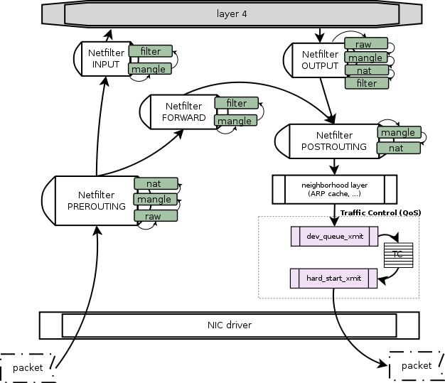
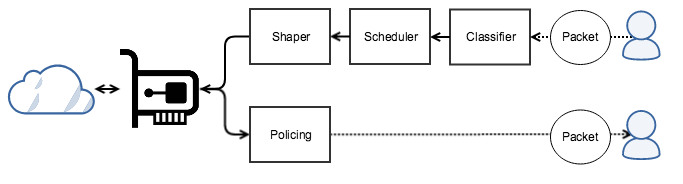
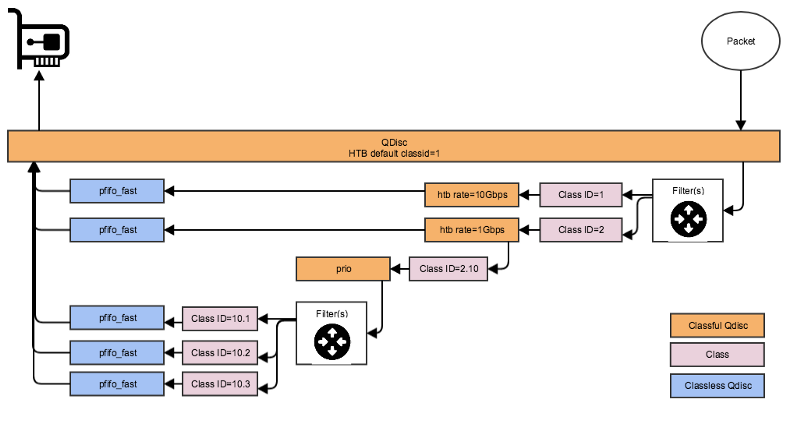
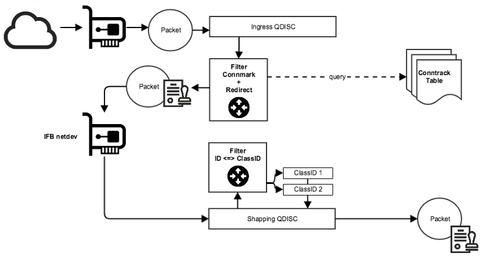
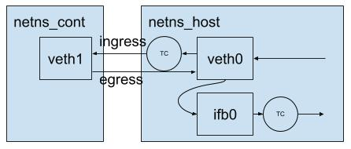

# How do I use CNI?

## Requirments

```bash
# 安装 golang，版本参考 [.travis.yaml](https://github.com/containernetworking/cni/blob/master/.travis.yml)
$ wget https://dl.google.com/go/go1.11.10.linux-amd64.tar.gz
$ tar -C /usr/local/ -xzf go1.11.10.linux-amd64.tar.gz 
$ cat >>$HOME/.bash_aliases <<EOF 
export PATH=${PATH:+$PATH:}/usr/local/go/bin
export GOPATH=$HOME/go
EOF
$ source $HOME/.bash_aliases

# Get plugins and CNIs
$ go get -v github.com/containernetworking/plugins
$ go get -v github.com/containernetworking/cni
```

## Test

```bash
# \begin create confs
$ mkdir -p /etc/cni/net.d
$ cat >/etc/cni/net.d/10-mynet.conf <<EOF
{
	"cniVersion": "0.2.0",
	"name": "mynet",
	"type": "bridge",
	"bridge": "cni0",
	"isGateway": true,
	"ipMasq": true,
	"ipam": {
		"type": "host-local",
		"subnet": "10.22.0.0/16",
		"routes": [
			{ "dst": "0.0.0.0/0" }
		]
	}
}
EOF
$ cat >/etc/cni/net.d/99-loopback.conf <<EOF
{
	"cniVersion": "0.2.0",
	"name": "lo",
	"type": "loopback"
}
EOF
# \end create confs

# \begin build plugins
$ cd $GOPATH/src/github.com/containernetworking/plugins/
$ ./build_linux.sh 
# \end build plugins

# \begin test0
$ sudo apt install jq
$ CNI_PATH=$GOPATH/src/github.com/containernetworking/plugins/bin
$ cd $GOPATH/src/github.com/containernetworking/cni/scripts
$ sudo CNI_PATH=$CNI_PATH ./priv-net-run.sh ifconfig
# \end test0

# \begin test1
$ sudo CNI_PATH=$CNI_PATH ./docker-run.sh --rm busybox:latest ifconfig
# \end test1
```

## Internals

已知命令：

```bash
$ CNI_PATH=$GOPATH/src/github.com/containernetworking/plugins/bin
$ sudo CNI_PATH=$CNI_PATH ./priv-net-run.sh ifconfig
```

其执行过程如下：

1. 创建一个 netns；
2. 调用 `exec-plugins.sh` 为该 netns 添加设备；
    1. 遍历 /etc/cni/net.d 下面的所有配置文件；
    2. 调用相应的 plugin，例如，`bridge 10-mynet.conf`，其它参数以环境变量的方式提供，包括 container ID、netns 路径。
3. 执行用户指定的命令，例如，`ifconfig`；
4. 删除该 netns。

## Bandwidth plugin

该插件允许我们使用和配置 Linux TC。TC encompasses the sets of mechanisms and operations by which packets are queued for transmission/reception on a network interface.

This plugin configures a token bucket filter (tbf) queuing discipline (qdisc) on both ingress and egress traffic. Resulting in traffic being shaped when reading / writing.

Due to limitations on tc shaping rules for ingress, this plugin creates an Intermediate Functional Block device (ifb) to redirect packets from the host interface. tc tbf is then applied to the ifb device. The packets that were redirected to the ifb devices, are written OUT (and shaped) to the host interface.

This plugin is only useful when used in addition to other plugins.

### `tc`



Linux 网络子系统中有两个框架会对网络包进行处理：netfilter 和 packet scheduler。Netfilter（对应用户空间的 iptables）用于构造防火墙和NAT，packet scheduler（对应用户空间的 tc）进行 traffic shaping。它们在内核中的位置如图。



Packet scheduler 的工作方式是在网络接口设备的出口方向上添加一些 qdisc 和 class，然后通过 filter 将数据包导入特定 class 的特定 qdisc，然后通过调用 qdisc 并结合 shaper 实现对流量的控制。如上图。



Notice that from the network card perspective, it is only talking to the root qdisc, which is actually polling packets from its children with it’s own algorithms, and this recursively until the leaf nodes are polled.



因为 qdisc 一般加在一个网络设备的出口方向，所以只能控制 egress 流量。若想对 ingress 流量进行 shaping，需要在路径上添加一个虚拟设备（ifb），然后将 ingress 流量导向该设备以完成 ingress 流量的 shaping。如下图。

### Chaining

The bandwidth plugin applies traffic shaping to interfaces (as described above) created by previously applied plugins.

The following is an example [json configuration list](https://github.com/containernetworking/cni/blob/master/SPEC.md#network-configuration-list-runtime-examples) for creating a `ptp` between the host -> container via veth interfaces, whereby traffic is shaped by the `bandwidth` plugin:

```json
{
  "cniVersion": "0.3.1",
  "name": "mynet",
  "plugins": [
    {
      "type": "ptp",
      "ipMasq": true,
      "mtu": 512,
      "ipam": {
          "type": "host-local",
          "subnet": "10.0.0.0/24"
      },
      "dns": {
        "nameservers": [ "10.1.0.1" ]
      }
    },
    {
      "name": "slowdown",
      "type": "bandwidth",
      "ingressRate": 123,
      "ingressBurst": 456,
      "egressRate": 123,
      "egressBurst": 456
    }
  ]
}
```

The result is an `ifb` device in the host namespace redirecting to the `host-interface`, with `tc tbf` applied on the `ifb` device and the `container-interface`.

```go
// @plugins/meta/bandwidth/main.go
func cmdAdd(args *skel.CmdArgs) error {
	conf, err := parseConfig(args.StdinData)
	if err != nil {
		return err
	}

	bandwidth := getBandwidth(conf)
	if bandwidth == nil || bandwidth.isZero() {
		return types.PrintResult(conf.PrevResult, conf.CNIVersion)
	}

	if conf.PrevResult == nil {
		return fmt.Errorf("must be called as chained plugin")
	}

	result, err := current.NewResultFromResult(conf.PrevResult)
	if err != nil {
		return fmt.Errorf("could not convert result to current version: %v", err)
	}

	netns, err := ns.GetNS(args.Netns)
	if err != nil {
		return fmt.Errorf("failed to open netns %q: %v", netns, err)
	}
	defer netns.Close()

	// get the veth peer of container interface in host namespace
	hostInterface, err := getHostInterface(result.Interfaces, args.IfName, netns)
	if err != nil {
		return err
	}

	if bandwidth.IngressRate > 0 && bandwidth.IngressBurst > 0 {
		err = CreateIngressQdisc(bandwidth.IngressRate, bandwidth.IngressBurst, hostInterface.Name)
		if err != nil {
			return err
		}
	}

	if bandwidth.EgressRate > 0 && bandwidth.EgressBurst > 0 {
		mtu, err := getMTU(hostInterface.Name)
		if err != nil {
			return err
		}

		ifbDeviceName, err := getIfbDeviceName(conf.Name, args.ContainerID)
		if err != nil {
			return err
		}

		err = CreateIfb(ifbDeviceName, mtu)
		if err != nil {
			return err
		}

		ifbDevice, err := netlink.LinkByName(ifbDeviceName)
		if err != nil {
			return err
		}

		result.Interfaces = append(result.Interfaces, &current.Interface{
			Name: ifbDeviceName,
			Mac:  ifbDevice.Attrs().HardwareAddr.String(),
		})
		err = CreateEgressQdisc(bandwidth.EgressRate, bandwidth.EgressBurst, hostInterface.Name, ifbDeviceName)
		if err != nil {
			return err
		}
	}

	return types.PrintResult(result, conf.CNIVersion)
}
```



### Network configuration reference

* ingressRate: is the rate in bps at which traffic can enter an interface. (See http://man7.org/linux/man-pages/man8/tbf.8.html)
* ingressBurst: is the maximum amount in bits that tokens can be made available for instantaneously. (See http://man7.org/linux/man-pages/man8/tbf.8.html)
* egressRate: is the rate in bps at which traffic can leave an interface. (See http://man7.org/linux/man-pages/man8/tbf.8.html)
* egressBurst: is the maximum amount in bits that tokens can be made available for instantaneously. (See http://man7.org/linux/man-pages/man8/tbf.8.html)

Both ingressRate and ingressBurst must be set in order to limit ingress bandwidth. If neither one is set, then ingress bandwidth is not limited.
Both egressRate and egressBurst must be set in order to limit egress bandwidth. If neither one is set, then egress bandwidth is not limited.

## Firewall plugin

This plugin creates firewall rules to allow traffic to/from container IP address via the host network .
It does not create any network interfaces and therefore does not set up connectivity by itself.
It is intended to be used as a chained plugins

### Operation
The following network configuration file

```json
{
    "cniVersion": "0.3.1",
    "name": "bridge-firewalld",
    "plugins": [
      {
        "type": "bridge",
        "bridge": "cni0",
        "isGateway": true,
        "ipMasq": true,
        "ipam": {
            "type": "host-local",
            "subnet": "10.88.0.0/16",
            "routes": [
                { "dst": "0.0.0.0/0" }
            ]
        }
      },
      {
        "type": "firewall",
      }
    ]
}
```

will allow any IP addresses configured by earlier plugins to send/receive traffic via the host.

A successful result would simply be an empty result, unless a previous plugin passed a previous result, in which case this plugin will return that previous result.

### Backends

This plugin supports multiple firewall backends that implement the desired functionality.
Available backends include `iptables` and `firewalld` and may be selected with the `backend` key.
If no `backend` key is given, the plugin will use firewalld if the service exists on the D-Bus system bus.
If no firewalld service is found, it will fall back to iptables.

### firewalld backend rule structure

When the `firewalld` backend is used, this example will place the IPAM allocated address for the container (e.g. 10.88.0.2) into firewalld's `trusted` zone, allowing it to send/receive traffic.


A sample standalone config list (with the file extension .conflist) using firewalld backend might
look like:

```json
{
    "cniVersion": "0.3.1",
    "name": "bridge-firewalld",
    "plugins": [
      {
        "type": "bridge",
        "bridge": "cni0",
        "isGateway": true,
        "ipMasq": true,
        "ipam": {
            "type": "host-local",
            "subnet": "10.88.0.0/16",
            "routes": [
                { "dst": "0.0.0.0/0" }
            ]
        }
      },
      {
        "type": "firewall",
	"backend": "firewalld"
      }
    ]
}
```


`FORWARD_IN_ZONES_SOURCE` chain:
- `-d 10.88.0.2 -j FWDI_trusted`

`CNI_FORWARD_OUT_ZONES_SOURCE` chain:
- `-s 10.88.0.2 -j FWDO_trusted`

### iptables backend rule structure

A sample standalone config list (with the file extension .conflist) using iptables backend might
look like:

```json
{
    "cniVersion": "0.3.1",
    "name": "bridge-firewalld",
    "plugins": [
      {
        "type": "bridge",
        "bridge": "cni0",
        "isGateway": true,
        "ipMasq": true,
        "ipam": {
            "type": "host-local",
            "subnet": "10.88.0.0/16",
            "routes": [
                { "dst": "0.0.0.0/0" }
            ]
        }
      },
      {
        "type": "firewall",
	"backend": "iptables"
      }
    ]
}
```

When the `iptables` backend is used, the above example will create two new iptables chains in the `filter` table and add rules that allow the given interface to send/receive traffic.

#### FORWARD

A new chain, CNI-FORWARD is added to the FORWARD chain.  CNI-FORWARD is the chain where rules will be added
when containers are created and from where rules will be removed when containers terminate.

`FORWARD` chain:
- `-j CNI-FORWARD`

CNI-FORWARD will have a pair of rules added, one for each direction, using the IPAM assigned IP address
of the container as shown:

`CNI_FORWARD` chain:
- `-s 10.88.0.2 -m conntrack --ctstate RELATED,ESTABLISHED -j CNI-FORWARD`
- `-d 10.88.0.2 -j CNI-FORWARD`

## Refs

- Demystification of TC. https://medium.com/criteo-labs/demystification-of-tc-de3dfe4067c2.
- CNI README. https://github.com/containernetworking/cni.
- Bandwidth plugin README. https://github.com/containernetworking/plugins/tree/master/plugins/meta/bandwidth.
- Firewall plugin README. https://github.com/containernetworking/plugins/tree/master/plugins/meta/firewall.
- tldp traffic control. http://tldp.org/HOWTO/Traffic-Control-HOWTO/components.html.
- man tbf. http://man7.org/linux/man-pages/man8/tbf.8.html.
- tc ingress and ifb mirroring. https://serverfault.com/questions/350023/tc-ingress-policing-and-ifb-mirroring.
- Classless queueing disciplines. http://tldp.org/HOWTO/Traffic-Control-HOWTO/classless-qdiscs.html.
- Journey to the Center of the Linux Kernel: Traffic Control, Shaping and QoS. http://wiki.linuxwall.info/doku.php/en:ressources:dossiers:networking:traffic_control.